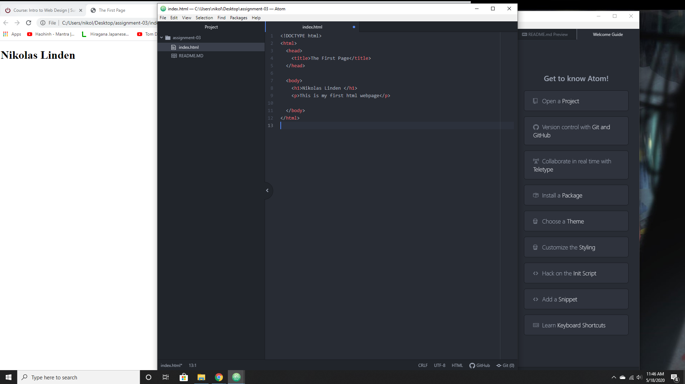

1. A browser is a piece of software used to access the world wide web. It retrieves information from the web to display in the software
2. Markup language is a language/system used to change what is displayed. It adds elements/tags that provide extra meaning for the web browser to structure the display with

