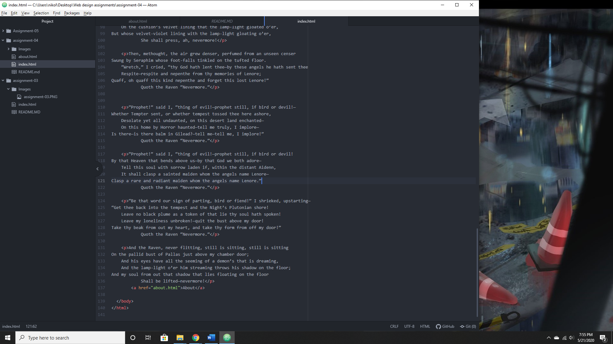

- I tried to visit Youtube, and I can see just comparing them side by side a lot is different. From layouts to new features, the website changes as the years go by, with the overall design becoming in my opinion better and the features that we see today being added, like Dark Mode.
- The modules are fairly easy to understand once you know how they work. It wasn't too difficult to begin with, but I did learn how the system works with how the GIT is essentially a directory system that we can add to then turn into a website to some degree
- 
