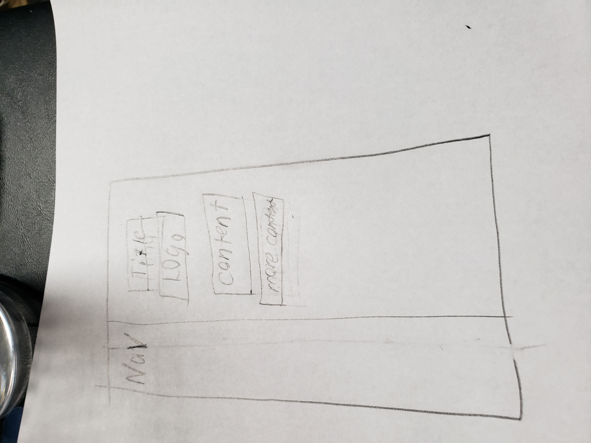

1. The padding is the space inside the border which spaces whatever is inside it away from the border. Margin does the same only outside the border, separating it from whatever else is around the border. The border itself is the center point of these two and acts as a visual box for the information inside it.
2. 
3. It took me about three in a half hours straight to do this through mostly trial and error. Some parts I didn't get to work right away, and then did something else for it to work that seemed right. The float aspect is what gave me the most trouble, even though it seemed a fairly easy subject.
